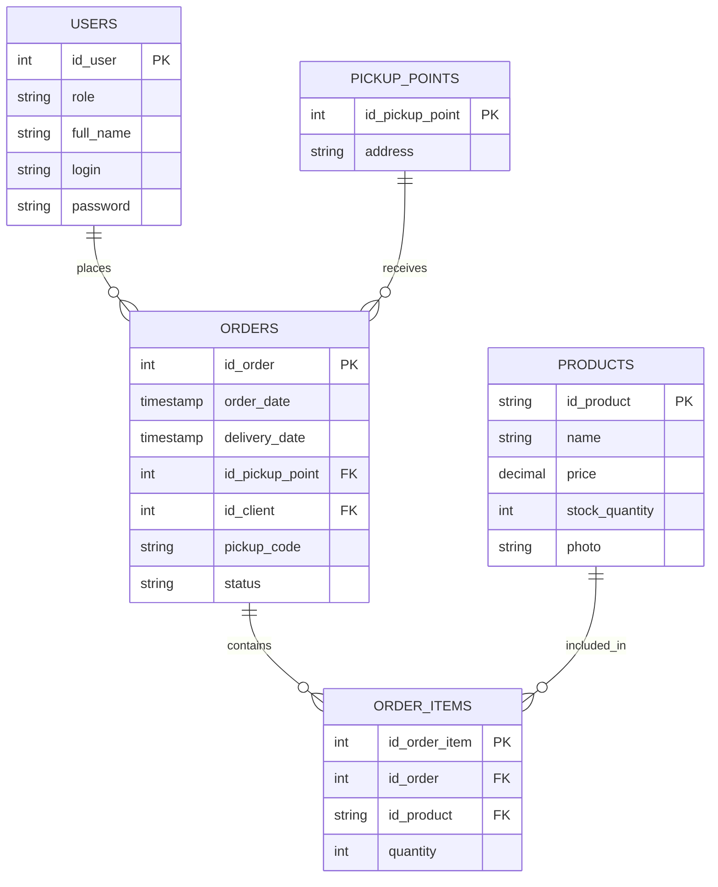

# ER-диаграмма

```mermaid
erDiagram
    USERS ||--o{ ORDERS : places
    PICKUP_POINTS ||--o{ ORDERS : receives
    ORDERS ||--o{ ORDER_ITEMS : contains
    PRODUCTS ||--o{ ORDER_ITEMS : included_in

    USERS {
        int id_user PK
        string role
        string full_name
        string login
        string password
    }

    PICKUP_POINTS {
        int id_pickup_point PK
        string address
    }

    PRODUCTS {
        string id_product PK
        string name
        decimal price
        int stock_quantity
        string photo
    }

    ORDERS {
        int id_order PK
        timestamp order_date
        timestamp delivery_date
        int id_pickup_point FK
        int id_client FK
        string pickup_code
        string status
    }

    ORDER_ITEMS {
        int id_order_item PK
        int id_order FK
        string id_product FK
        int quantity
    }
```

Схема соответствует внешним ключам в `database/shoe_store.sql`.
